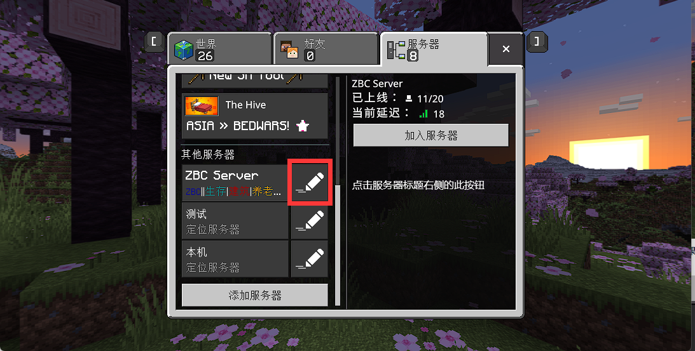

# 无法连接/进入服务器
## 卡在正在下载资源包
## 无法连接至世界
  
仔细核对此界面的地址是否与服务器的地址端口是否一致。有时服务器迁移后地址和端口发生更改，你也需要更改此处设置。
**如果使用流量游戏，请进入游戏设置，打开图中的开关**
  
如果仍然无法连接，请检查网络， iOS如果信号差，会即使有信号显示，能上QQ微信也连不上服务器，此外不要将应用切后台，如果中途需要使用其他app，回到游戏时请关闭游戏再重新打开，因为游戏切后台之后再返回就不能连上服务器了  
一些代理软件也可能导致连不上，请关闭任何可能影响网络连接的代理软件再试  
如果一切正常但仍然无法连接，可测试其他服务器的连接情况，排查是否是服务器自身问题    
## 无法连接：过期的客户端！
请升级游戏至最新版  
## 无法连接：过期的服务器！/主机使用的是较旧版本的《我的世界》。每个人都应该更新到最新版本的《我的世界》，然后重试。
此情况往往发生在官方例行更新后，平均5周一次，请务必将应用商店的自动更新关闭，随服务器官方通知手动更新游戏。  
Windows/安卓可前往mc.minebbs.com下载重装上一个版本的游戏解决问题，iOS请根据[此教程](minecraft_installation/bedrock/ios?id=%e9%80%9a%e8%bf%87trollstore%e5%ae%89%e8%a3%85)安装相应版本。
## 您必须通过Microsoft身份认证。
微软服务器抽风导致登录服务器失败，而登录服务器必须连接微软服务器登录一次才能开始连接服务器，遇到此情况请重启游戏，更换网络再试，如果多人出现此问题，证明微软服务器故障或者运营商阻断 _（比如2023.10.1移动联通因“护网行动”在部分地区屏蔽部分微软服务造成全国范围内大量玩家无法登录正版）_ ，只能等待相关方面恢复后再试
## 正在从服务器断开连接
你自己的网络不稳定，或者服务器网络不稳定。服务器关服、断网、死机、停电也会导致这样。
## 服务器发送了破损的数据包/服务器与客户端的方块不一致
请联系服务器管理员，此问题大概率是服务器软件自身bug导致
