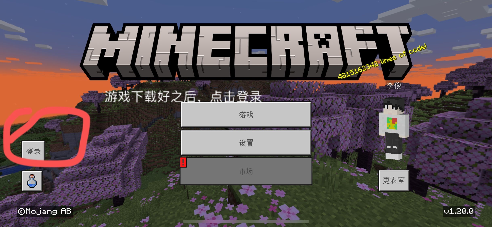
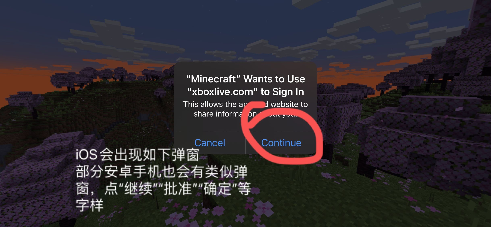
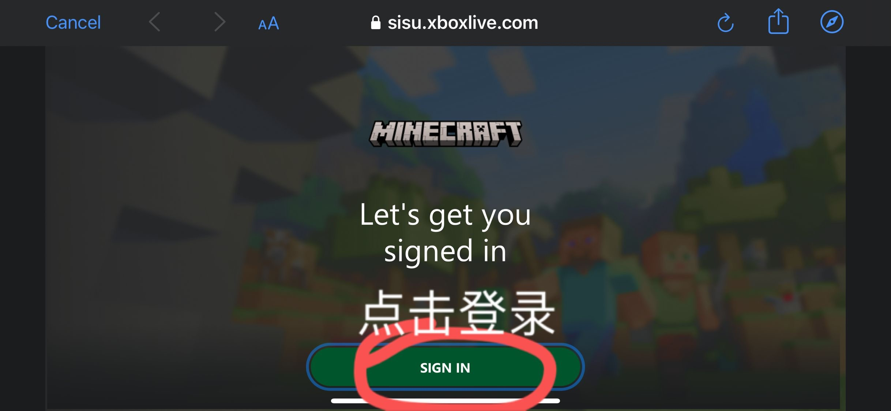
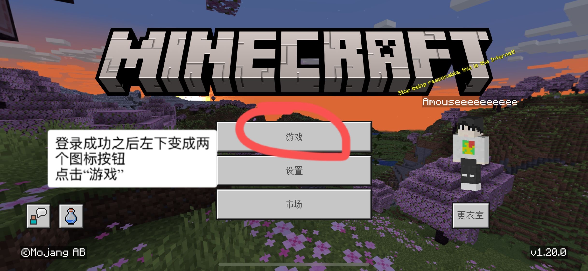
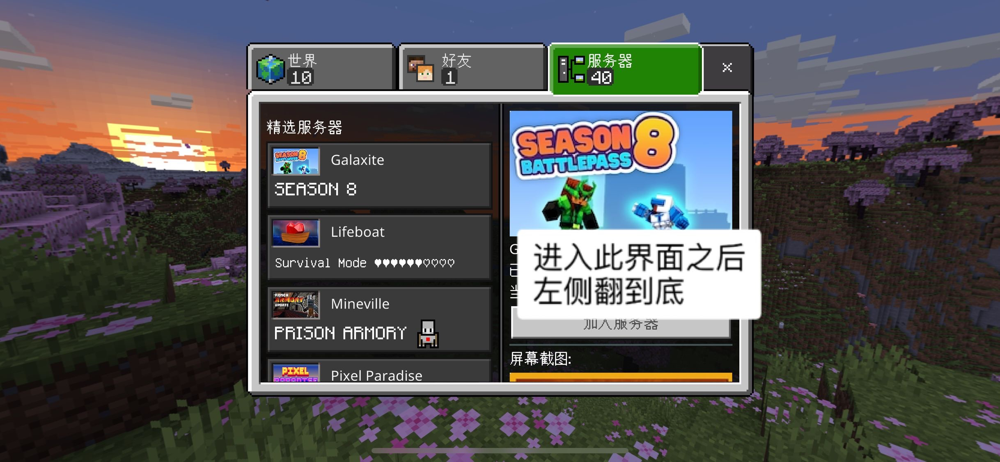
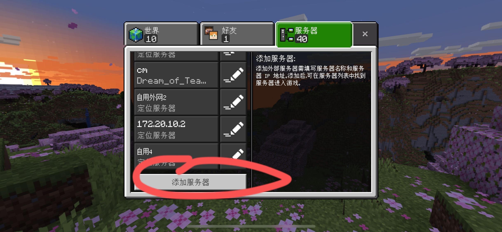
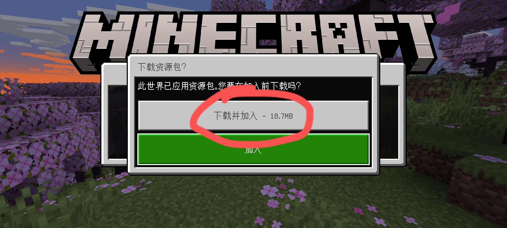
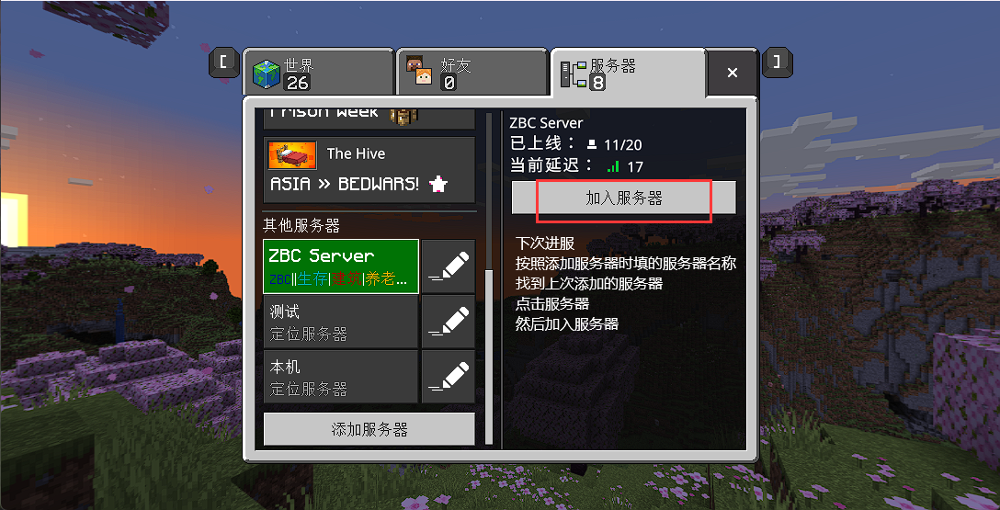

# 连接基岩版服务器
  
  
  
  
注册/登录你的微软帐号，此步骤暂无截图  
  
  
  
  
  

- **服务器名称**：这里写什么都行不影响进服，相当于给服务器的备注
- **服务器地址**、**服务器端口**：填写服务器的地址和端口
  - 如果只写了一个地址（没有看到提供端口）
    1. 以一个冒号和一串数字结尾，这种地址冒号前面的填进地址，冒号后面的填进端口，冒号本身不填进去，比如地址是`zbc.eo.mk:15001`，那么服务器地址填写`zbc.eo.mk`，服务器端口填写`15001`。
    2. 地址只有点，没有冒号，比如`zbc.eo.mk`，直接把地址填进服务器地址，服务器端口直接填写`19132`。如果`19132`显示无法连接至世界，再试试`19133`。

全部填写好后，点击**游戏**。

  
  
如果按照以上步骤操作之后还是不能连接到服务器，请阅读[无法进入服务器](Minecraft_tutorials/Server/cannotconnect.md)  
